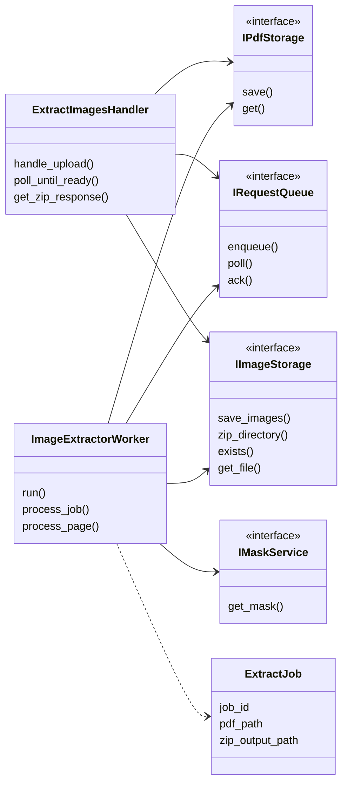

# PDF Parser – Class Diagram

This document describes the class structure of the PDF image extraction system. The design follows **SOLID** principles and aligns with the [sequence diagram](./sequence_diagram.md).

---

## Overview

- **Interfaces (abstractions)** define contracts for storage, queue, and U-Net client so the backend and workers depend on abstractions (DIP).
- **Value objects / DTOs** (`ExtractJob`, `JobResult`) carry data between components.
- **Concrete implementations** can be swapped (e.g. Redis queue, S3 storage) without changing orchestration logic (OCP, LSP).

---

## Class Diagram (Mermaid)

```mermaid
classDiagram
    direction TB

    %% ========== DTOs / Value Objects ==========
    class ExtractJob {
        +str job_id
        +str pdf_path
        +str zip_output_path
        +datetime created_at
    }

    class JobResult {
        +str job_id
        +str zip_path
        +bool success
        +Optional~str~ error_message
    }

    %% ========== Storage Abstractions ==========
    class IPdfStorage {
        <<interface>>
        +save(pdf_bytes: bytes, path: str) str
        +get(path: str) bytes
        +delete(path: str) void
    }

    class IImageStorage {
        <<interface>>
        +save_images(job_id: str, page_idx: int, images: List~Image~) void
        +zip_directory(job_id: str, output_path: str) void
        +exists(path: str) bool
        +get_file(path: str) bytes
    }

    %% ========== Queue Abstraction ==========
    class IRequestQueue {
        <<interface>>
        +enqueue(job: ExtractJob) void
        +poll() Optional~ExtractJob~
        +ack(job_id: str) void
        +nack(job_id: str) void
    }

    %% ========== U-Net / Mask Service ==========
    class IMaskService {
        <<interface>>
        +get_mask(page_base64: str) bytes
    }

    %% ========== PDF / Page Handling ==========
    class IPdfParser {
        <<interface>>
        +split_into_pages(pdf_bytes: bytes) List~bytes~
        +page_to_base64(page_bytes: bytes) str
    }

    class IImageExtractor {
        <<interface>>
        +extract_images(page_bytes: bytes, mask: bytes) List~Image~
    }

    %% ========== Orchestrators ==========
    class ExtractImagesHandler {
        -IPdfStorage pdf_storage
        -IRequestQueue queue
        -IImageStorage image_storage
        -str base_pdf_path
        -str base_zip_path
        -int poll_interval_sec
        +handle_upload(pdf_bytes: bytes) ExtractJob
        +poll_until_ready(job_id: str, timeout_sec: int) Optional~bytes~
        +get_zip_response(job_id: str) Response
    }

    class ImageExtractorWorker {
        -IRequestQueue queue
        -IPdfStorage pdf_storage
        -IImageStorage image_storage
        -IMaskService mask_service
        -IPdfParser pdf_parser
        -IImageExtractor image_extractor
        -ExecutorService page_executor
        +run() void
        -process_job(job: ExtractJob) void
        -process_page(job_id: str, page_idx: int, page_bytes: bytes) void
    }

    %% ========== Concrete Implementations ==========
    class FileSystemPdfStorage {
        -str base_path
        +save(pdf_bytes: bytes, path: str) str
        +get(path: str) bytes
        +delete(path: str) void
    }

    class FileSystemImageStorage {
        -str base_images_path
        -str base_zip_path
        +save_images(job_id: str, page_idx: int, images: List~Image~) void
        +zip_directory(job_id: str, output_path: str) void
        +exists(path: str) bool
        +get_file(path: str) bytes
    }

    class RedisRequestQueue {
        -Redis client
        -str queue_name
        +enqueue(job: ExtractJob) void
        +poll() Optional~ExtractJob~
        +ack(job_id: str) void
        +nack(job_id: str) void
    }

    class UnetHttpClient {
        -str base_url
        -HttpClient client
        +get_mask(page_base64: str) bytes
    }

    class PyMuPdfParser {
        +split_into_pages(pdf_bytes: bytes) List~bytes~
        +page_to_base64(page_bytes: bytes) str
    }

    class MaskBasedImageExtractor {
        +extract_images(page_bytes: bytes, mask: bytes) List~Image~
    }

    %% ========== API Layer ==========
    class ExtractController {
        -ExtractImagesHandler handler
        +post_extract(request: Request) Response
    }

    %% ========== Relationships ==========
    ExtractJob --> JobResult : produces

    IPdfStorage <|.. FileSystemPdfStorage : implements
    IImageStorage <|.. FileSystemImageStorage : implements
    IRequestQueue <|.. RedisRequestQueue : implements
    IMaskService <|.. UnetHttpClient : implements
    IPdfParser <|.. PyMuPdfParser : implements
    IImageExtractor <|.. MaskBasedImageExtractor : implements

    ExtractImagesHandler o-- IPdfStorage : uses
    ExtractImagesHandler o-- IRequestQueue : uses
    ExtractImagesHandler o-- IImageStorage : uses

    ImageExtractorWorker o-- IRequestQueue : uses
    ImageExtractorWorker o-- IPdfStorage : uses
    ImageExtractorWorker o-- IImageStorage : uses
    ImageExtractorWorker o-- IMaskService : uses
    ImageExtractorWorker o-- IPdfParser : uses
    ImageExtractorWorker o-- IImageExtractor : uses

    ExtractController o-- ExtractImagesHandler : uses
    ImageExtractorWorker ..> ExtractJob : consumes
```



---

## Simplified Class Diagram (Core Components Only)



---

## SOLID Mapping

| Principle | Application in Class Design |
|-----------|-----------------------------|
| **S**ingle Responsibility | `ExtractImagesHandler` only orchestrates upload + poll + response. `ImageExtractorWorker` only processes one job (fetch PDF → pages → U-Net → extract → save → zip). Storage/queue/mask each have one responsibility. |
| **O**pen/Closed | New storage (e.g. S3) or queue (e.g. SQS) added by implementing `IPdfStorage` / `IRequestQueue` without changing `ExtractImagesHandler` or `ImageExtractorWorker`. |
| **L**iskov Substitution | Any `IPdfStorage` implementation can replace `FileSystemPdfStorage`; any `IRequestQueue` can replace `RedisRequestQueue`. Workers are interchangeable. |
| **I**nterface Segregation | Narrow interfaces: `IPdfStorage` (save/get), `IImageStorage` (images + zip + exists/get), `IMaskService` (get_mask only). No fat interface. |
| **D**ependency Inversion | `ExtractImagesHandler` and `ImageExtractorWorker` depend on `IPdfStorage`, `IRequestQueue`, `IImageStorage`, `IMaskService`, not on concrete classes. |

---

## Component Summary

| Component | Type | Role |
|-----------|------|------|
| `ExtractJob` | DTO | Job descriptor (job_id, pdf_path, zip_output_path) passed via queue. |
| `JobResult` | DTO | Optional result descriptor (e.g. for callbacks or logging). |
| `IPdfStorage` | Interface | Save and retrieve PDF bytes by path. |
| `IImageStorage` | Interface | Save images per job/page, zip directory to path, check existence, get zip bytes. |
| `IRequestQueue` | Interface | Enqueue job, poll/claim job, ack/nack. |
| `IMaskService` | Interface | Get segmentation mask for a page (base64 in → mask bytes out). |
| `IPdfParser` | Interface | Split PDF into page bytes; convert page to base64. |
| `IImageExtractor` | Interface | Extract image list from page bytes using mask. |
| `ExtractImagesHandler` | Orchestrator | Handle upload (save PDF, enqueue), poll until zip exists, return zip response. |
| `ImageExtractorWorker` | Worker | Poll queue, process job (PDF → pages → mask → extract → save → zip). |
| `ExtractController` | API | HTTP endpoint that uses `ExtractImagesHandler`. |
| `FileSystemPdfStorage`, `FileSystemImageStorage`, `RedisRequestQueue`, `UnetHttpClient`, `PyMuPdfParser`, `MaskBasedImageExtractor` | Concrete | Example implementations of the interfaces. |

---

## Dependency Flow

```
ExtractController
    → ExtractImagesHandler
        → IPdfStorage, IRequestQueue, IImageStorage

ImageExtractorWorker
    → IRequestQueue, IPdfStorage, IImageStorage, IMaskService, IPdfParser, IImageExtractor
```

High-level modules (Handler, Worker) depend on abstractions; concrete implementations are injected (e.g. at startup or via config).
