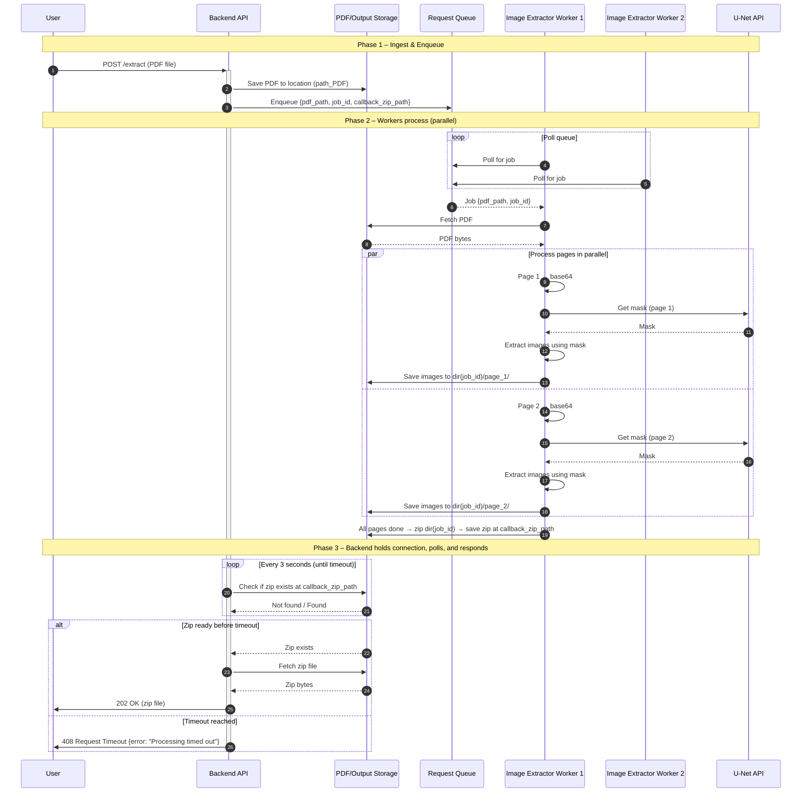

# PDF Parser – Sequence Diagram

This document describes the end-to-end flow of the PDF image extraction system. The design applies **SOLID** principles:

- **S**ingle Responsibility: Each component has one clear responsibility (API, storage, queue, workers, U-Net).
- **O**pen/Closed: Workers and storage are extensible without changing core flow.
- **L**iskov Substitution: Image extractor workers are interchangeable.
- **I**nterface Segregation: Narrow interfaces (e.g. PDF receiver, queue consumer, zip poller).
- **D**ependency Inversion: Backend depends on abstractions (queue, storage, zip location) not concrete implementations.

---

## High-Level Flow



---

```

---

## Component Responsibilities (SOLID Mapping)

| Component            | Responsibility                          | SOLID note                    |
|---------------------|-----------------------------------------|-------------------------------|
| **Backend API**     | Receive PDF, enqueue job, hold connection, poll for zip, return zip or timeout error | SRP: orchestration only       |
| **PDF Storage**      | Save/retrieve PDF by path               | SRP; depend on interface      |
| **Request Queue**   | Enqueue/dequeue job descriptors         | SRP; backend & workers depend on abstraction |
| **Image Extractor Worker** | Poll queue, load PDF, call U-Net, extract & save images, create zip | SRP per worker; workers substitutable (LSP) |
| **U-Net API**       | Accept base64 page, return mask         | SRP; single interface         |
| **Image/Zip Storage** | Save images per job, write zip at path   | SRP; backend polls abstraction |

---

## Parallelism Summary

- **Multiple workers**: Several image-extractor jobs poll the same queue; each claimed job is processed by one worker.
- **Multiple pages**: Within one job, pages are processed in parallel (e.g. thread pool or async tasks); each page: base64 → U-Net mask → extract images → save to `dir(job_id)/page_N/`.
- **Backend polling**: Holds the user connection open and polls every 3 seconds until the zip appears or a timeout is reached; responds with 202 + zip file on success, or 408 timeout error on failure.
